<!-- 
===============================================================================
FILE PATH: README.md
SEGMENT: Master SOC & GRC Operations Ecosystem
PURPOSE: Central architecture reference, domain taxonomy, quick start guides, and daily operational flow standards for Blue Teams, Detection Engineers, DFIR Specialists, and GRC Auditors.
CONNECTED WORKFLOWS:
  - Governs all 11 operational domains (01 through 11) and CI/CD pipelines in .github/workflows/
===============================================================================
-->

# SOC and GRC Operations Ecosystem

This repository is a production-grade, modular operations framework built for Security Operations Centers, Detection Engineering teams, Digital Forensics and Incident Response practitioners, and Governance, Risk, and Compliance auditors. It is not a loose collection of notes or a starter template. It is an end-to-end operational architecture that mirrors the way real security teams ingest data, detect threats, triage alerts, hunt adversaries, respond to incidents, preserve evidence, measure performance, and prove compliance to external auditors.

Every directory in this repository maps to a distinct operational domain. Every file within those directories serves a specific function in the security lifecycle. And every domain connects to at least one other domain through clearly defined data flows, escalation paths, or feedback loops. Nothing exists in isolation here.

The sections below walk through the full architecture, explain what each domain does, show exactly how every file relates to every other file, and lay out the operational flows that tie the whole system together.

---

## Table of Contents

- [Architecture Overview](#architecture-overview)
- [Master Domain Connection Graph](#master-domain-connection-graph)
- [Operational Data Flow](#operational-data-flow)
- [Domain 01: Data Sources and Ingestion](#domain-01-data-sources-and-ingestion)
- [Domain 02: Normalization and Parsing](#domain-02-normalization-and-parsing)
- [Domain 03: Detection Engineering](#domain-03-detection-engineering)
- [Domain 04: Alert Lifecycle and Triage](#domain-04-alert-lifecycle-and-triage)
- [Domain 05: Threat Hunting](#domain-05-threat-hunting)
- [Domain 06: Threat Intelligence and IOCs](#domain-06-threat-intelligence-and-iocs)
- [Domain 07: Incident Response and SOAR](#domain-07-incident-response-and-soar)
- [Domain 08: Forensics and Artefacts](#domain-08-forensics-and-artefacts)
- [Domain 09: Evidence Management](#domain-09-evidence-management)
- [Domain 10: Metrics, KPIs, and Reporting](#domain-10-metrics-kpis-and-reporting)
- [Domain 11: GRC, Audit, and Compliance](#domain-11-grc-audit-and-compliance)
- [CI/CD Pipelines](#cicd-pipelines)
- [Complete File Inventory](#complete-file-inventory)
- [Cross-Domain File Dependency Map](#cross-domain-file-dependency-map)
- [Who Uses What](#who-uses-what)
- [Getting Started](#getting-started)

---

## Architecture Overview

This ecosystem is organized into eleven numbered domains. The numbering is not arbitrary. It follows the natural lifecycle of a security event, from the moment raw telemetry leaves an endpoint or cloud service, all the way through to the moment an external auditor signs off on your compliance posture. Think of it as a pipeline where each domain transforms, enriches, or acts on the output of the domain before it.

There are also lateral connections. Threat intelligence feeds into triage and hunting simultaneously. Hunting discoveries loop back into detection engineering. Metrics measure the performance of triage and feed tuning recommendations back into detection rules. Evidence management bridges forensics with compliance. The architecture is not a straight line. It is a directed graph with feedback loops, and the diagrams below make those connections visible.

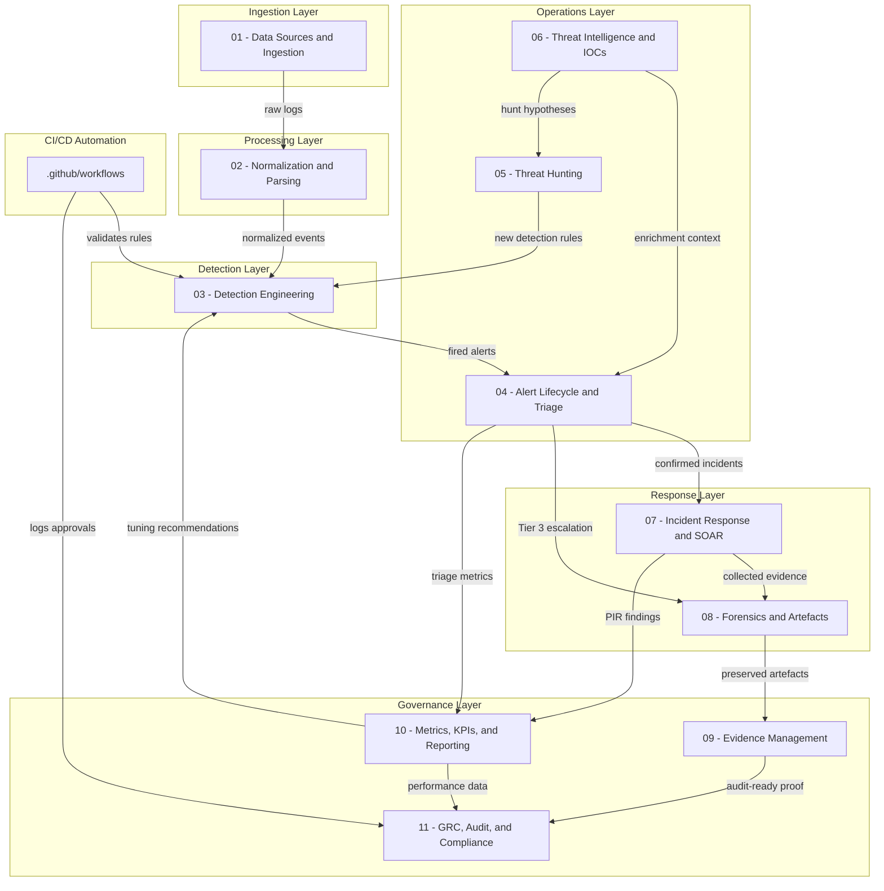

---

## Master Domain Connection Graph

The graph below shows every direct dependency between domains. Each arrow represents a real operational handoff: data, escalation, feedback, or evidence transfer. If two domains are connected, it means someone on your team will regularly move work products between them.

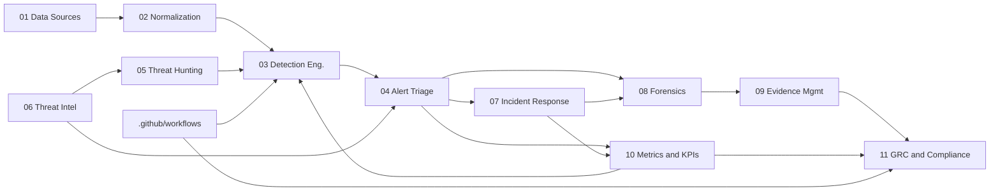

---

## Operational Data Flow

This is the step-by-step walkthrough of how a security event travels through the ecosystem, from raw log to compliance evidence. Each step corresponds to a domain and to specific files within that domain.

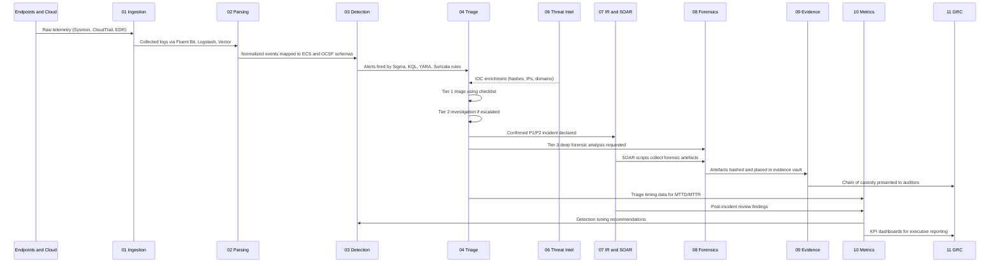

**Step 1.** Endpoints, cloud environments, and network devices generate raw telemetry. Windows Event Logs, Sysmon traces, AWS CloudTrail records, EDR agent output, and firewall syslogs all pour into the ingestion layer.

**Step 2.** Collector agents (Fluent Bit, Logstash, Vector) in Domain 01 gather these raw logs and forward them to Domain 02 for normalization.

**Step 3.** Domain 02 maps vendor-specific field names into standardized schemas. The field dictionary defines the canonical naming convention. ECS and OCSF mapping files handle the actual translation so that a Sysmon `TargetFilename` and a CloudTrail `requestParameters.bucketName` both land in predictable, queryable fields.

**Step 4.** Domain 03 runs detection logic against the normalized events. Sigma rules catch cross-platform threats. KQL queries handle Microsoft Sentinel and Defender telemetry. YARA rules scan file content. Suricata signatures inspect network traffic. SQL queries audit database activity. When a rule matches, it fires an alert.

**Step 5.** Domain 04 receives the alert. A Tier 1 analyst picks it up, follows the triage checklist, checks the severity matrix for SLA targets, and decides whether to close it as a false positive, escalate to Tier 2 for deeper investigation, or escalate to Tier 3 for forensic analysis.

**Step 6.** Domain 06 enriches the triage process. IOC blocklists (domain, hash, IP reputation) are checked against alert observables. MITRE ATT&CK mappings provide context about which technique the adversary likely used. Threat actor profiles like APT29/Midnight Blizzard give analysts the bigger picture.

**Step 7.** If the alert is confirmed as a real incident at P1 or P2 severity, it escalates to Domain 07. The appropriate incident playbook is activated (ransomware, phishing, credential dumping, cloud compromise, or insider threat). SOAR automation scripts can immediately isolate compromised hosts via EDR API calls or disable compromised user accounts.

**Step 8.** Domain 08 conducts the deep forensic analysis. Windows event log carving, memory analysis with Volatility, disk imaging, network PCAP triage with Zeek and Wireshark, and Linux auditd/journalctl investigation all happen here.

**Step 9.** Domain 09 takes the forensic artefacts and places them into a secure evidence vault. Every piece of evidence gets a SHA-256 hash logged in the verification log. The chain of custody template tracks who touched what and when.

**Step 10.** Domain 10 measures everything. MTTD (Mean Time to Detect) and MTTR (Mean Time to Respond) dashboards track how fast the team is performing. Post-incident reviews capture lessons learned. Executive summary templates roll the numbers up for CISO reporting. When metrics reveal that certain detection rules are generating too many false positives or missing real threats, those findings feed back into Domain 03 as tuning recommendations.

**Step 11.** Domain 11 takes all of this operational evidence and maps it to compliance frameworks. SOC 2 Type II, ISO 27001:2022, and NIST CSF 2.0 control mappings prove to external auditors that the organization is not just saying it does security but is actually doing it, with logs, timestamps, and hash-verified proof.

---

## Domain 01: Data Sources and Ingestion

This is where everything begins. Before you can detect a threat, you need to collect the telemetry that contains evidence of that threat. Domain 01 defines what logs you collect, how you collect them, and how long you keep them.

### Directory Structure

```
01-DATA-SOURCES-AND-INGESTION/
    README.md
    collectors-and-agents/
        fluentbit/
            fluent-bit.conf
        logstash/
            pipeline-syslog.conf
        vector/
            vector.yaml
    log-inventory/
        cloud-logs-aws-gcp-azure.md
        edr-telemetry-inventory.md
        sysmon-configs/
            sysmonconfig-export.xml
        windows-event-logs.md
    log-retention-and-dlp/
        log-retention-policy.md
```

### File-Level Connection Map

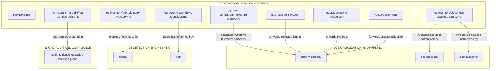

### What Each File Does

**collectors-and-agents/fluentbit/fluent-bit.conf** is the configuration for Fluent Bit, a lightweight log shipper. It defines input sources, parsing rules, and output destinations. This is the agent that sits on endpoints or forwarding servers and pushes logs into your SIEM pipeline.

**collectors-and-agents/logstash/pipeline-syslog.conf** handles syslog ingestion through Logstash. Network devices, firewalls, and Linux servers that speak syslog protocol get their logs collected and forwarded by this pipeline.

**collectors-and-agents/vector/vector.yaml** is the Vector configuration. Vector is a high-performance observability data pipeline that can replace or complement Logstash and Fluent Bit. This config defines sources, transforms, and sinks for log data.

**log-inventory/cloud-logs-aws-gcp-azure.md** catalogs every cloud log source the SOC monitors. AWS CloudTrail, GuardDuty, VPC Flow Logs, GCP Audit Logs, Azure Activity Logs, and similar services are inventoried here with their ingestion status and coverage gaps.

**log-inventory/edr-telemetry-inventory.md** catalogs the telemetry coming from Endpoint Detection and Response tools. Which agents are deployed, what telemetry types they produce (process creation, file modification, network connection, registry changes), and where those events land.

**log-inventory/sysmon-configs/sysmonconfig-export.xml** is the Sysmon configuration file that defines which Windows system events get logged. This is the single most important file for Windows visibility because it controls whether you see process creation with command-line arguments, network connections, DLL loads, file creation timestamps, and registry modifications.

**log-inventory/windows-event-logs.md** documents which Windows Event Log channels and Event IDs the SOC collects. Security log Event ID 4688 for process creation, 4624/4625 for logon events, PowerShell Script Block Logging, and similar sources are all documented here.

**log-retention-and-dlp/log-retention-policy.md** defines how long each log type is retained, which tiers of storage are used (hot, warm, cold, archive), and what the regulatory requirements are for retention periods. This file directly supports compliance evidence in Domain 11.

---

## Domain 02: Normalization and Parsing

Raw logs from different vendors use different field names, different timestamp formats, and different structures. Domain 02 solves that problem by mapping everything into standardized schemas so that detection rules and hunting queries can be written once and work across all data sources.

### Directory Structure

```
02-NORMALIZATION-AND-PARSING/
    README.md
    field-dictionary.md
    custom-parsers/
        syslog-parsers/
            palo-alto-firewall.grok
    ecs-mapping/
        ecs-process-event.json
    ocsf-mapping/
        ocsf-process-activity.json
```

### File-Level Connection Map

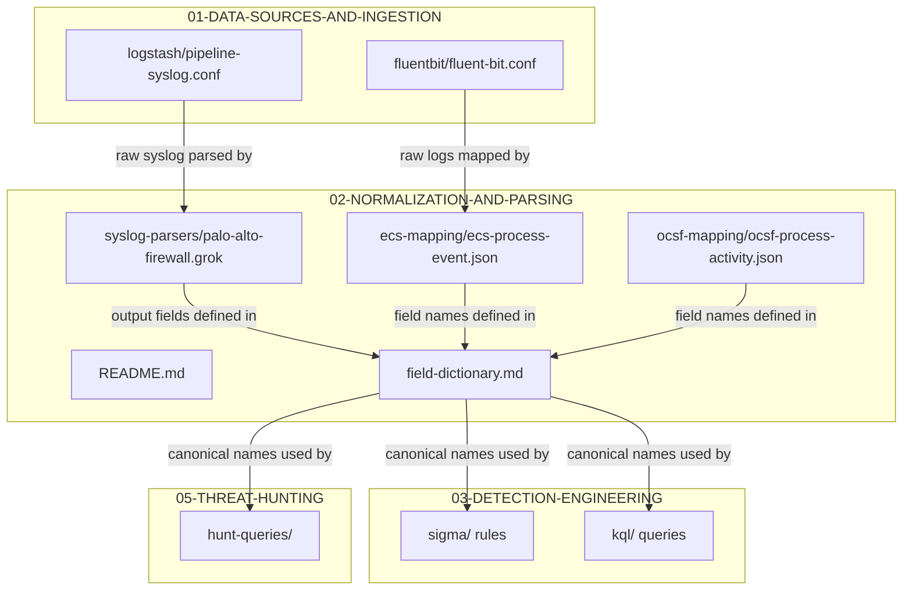

### What Each File Does

**field-dictionary.md** is the Rosetta Stone of this entire ecosystem. It maps vendor-specific field names (like Sysmon's `Image`, `ParentImage`, `TargetFilename`, or CloudTrail's `userIdentity.arn`) to standardized SOC dictionary terms. Every detection rule author and every threat hunter references this file to make sure they are using the right field names in their queries.

**custom-parsers/syslog-parsers/palo-alto-firewall.grok** is a Grok pattern file that teaches Logstash how to parse Palo Alto firewall syslog messages. Palo Alto firewalls send comma-separated syslog with a specific field order, and this pattern breaks that raw string into named fields.

**ecs-mapping/ecs-process-event.json** defines how process creation events are mapped into Elastic Common Schema format. Fields like `process.name`, `process.pid`, `process.command_line`, and `process.parent.name` are standardized here.

**ocsf-mapping/ocsf-process-activity.json** does the same mapping but for the Open Cybersecurity Schema Framework. OCSF is a newer standard backed by AWS and Splunk, and this mapping ensures compatibility with platforms that adopt it.

---

## Domain 03: Detection Engineering

This is the heart of the SOC. Domain 03 contains every detection rule, every testing artifact, and every tuning record. It is organized by detection language and by platform, and it connects to CI/CD pipelines that validate rules before they reach production.

### Directory Structure

```
03-DETECTION-ENGINEERING/
    README.md
    detection-testing/
        atomic-red-team-tests/
            T1003.001-lsass-dump-test.yaml
        rule-validation-matrix.md
    detection-tuning/
        false-positive-logs.md
        rule-suppression-list.md
    kql/
        persistence/
            registry_runkeys_modification.kql
        privilege-escalation/
            lsass_memory_dumping.kql
        process-execution/
            suspicious_cmd_parent_child.kql
    sigma/
        cloud/
            aws_unusual_root_login.yml
        linux/
            proc_creation_lnx_reversed_shell.yml
        windows/
            proc_creation_win_mimikatz_cmdline.yml
    sql/
        database-audit-queries/
            unauthorized_db_admin_creation.sql
    suricata-snort/
        network-signatures/
            emerging_threats_c2.rules
    yara/
        malware-families/
            ransomware_generic_strings.yar
        webshells/
            php_webshell_obfuscated.yar
```

### File-Level Connection Map

```mermaid
flowchart TD
    subgraph "03-DETECTION-ENGINEERING"
        SIGMA_WIN["sigma/windows/proc_creation_win_mimikatz_cmdline.yml"]
        SIGMA_LNX["sigma/linux/proc_creation_lnx_reversed_shell.yml"]
        SIGMA_CLD["sigma/cloud/aws_unusual_root_login.yml"]
        KQL_PERSIS["kql/persistence/registry_runkeys_modification.kql"]
        KQL_PRIV["kql/privilege-escalation/lsass_memory_dumping.kql"]
        KQL_PROC["kql/process-execution/suspicious_cmd_parent_child.kql"]
        SQL_DB["sql/database-audit-queries/unauthorized_db_admin_creation.sql"]
        SURI["suricata-snort/network-signatures/emerging_threats_c2.rules"]
        YARA_RANSOM["yara/malware-families/ransomware_generic_strings.yar"]
        YARA_WEBSH["yara/webshells/php_webshell_obfuscated.yar"]
        ATOMIC["detection-testing/atomic-red-team-tests/T1003.001-lsass-dump-test.yaml"]
        VALMATRIX["detection-testing/rule-validation-matrix.md"]
        FPLOG["detection-tuning/false-positive-logs.md"]
        SUPPRESS["detection-tuning/rule-suppression-list.md"]
    end

    subgraph "CI/CD"
        SIGMAVAL[".github/workflows/validate-sigma-rules.yml"]
        KQLVAL[".github/workflows/kql-lint-check.yml"]
    end

    subgraph "04-ALERT-LIFECYCLE-AND-TRIAGE"
        TRIAGE["triage-guides/"]
    end

    subgraph "06-THREAT-INTELLIGENCE"
        MITRE["mitre-attack-mapping/coverage-matrix.md"]
    end

    subgraph "11-GRC-AUDIT"
        CHANGELOG["audit-evidence-locker/change-management-logs/"]
    end

    SIGMA_WIN -->|"fires alerts to"| TRIAGE
    SIGMA_LNX -->|"fires alerts to"| TRIAGE
    SIGMA_CLD -->|"fires alerts to"| TRIAGE
    KQL_PERSIS -->|"fires alerts to"| TRIAGE
    KQL_PRIV -->|"fires alerts to"| TRIAGE
    KQL_PROC -->|"fires alerts to"| TRIAGE
    SURI -->|"fires alerts to"| TRIAGE
    ATOMIC -->|"validates"| KQL_PRIV
    ATOMIC -->|"validates"| SIGMA_WIN
    VALMATRIX -->|"tracks test coverage of"| SIGMA_WIN
    SIGMAVAL -->|"lints and validates"| SIGMA_WIN
    SIGMAVAL -->|"lints and validates"| SIGMA_LNX
    SIGMAVAL -->|"lints and validates"| SIGMA_CLD
    KQLVAL -->|"validates syntax of"| KQL_PERSIS
    KQLVAL -->|"validates syntax of"| KQL_PRIV
    KQLVAL -->|"validates syntax of"| KQL_PROC
    FPLOG -->|"tuning feedback for"| SIGMA_WIN
    SUPPRESS -->|"suppression entries for"| SIGMA_WIN
    MITRE -->|"maps techniques in"| SIGMA_WIN
    SIGMAVAL -->|"logs deployment approval to"| CHANGELOG
```

### What Each File Does

**sigma/windows/proc_creation_win_mimikatz_cmdline.yml** detects Mimikatz execution on Windows by matching known command-line patterns associated with credential dumping tools. This maps to MITRE ATT&CK technique T1003 (OS Credential Dumping).

**sigma/linux/proc_creation_lnx_reversed_shell.yml** detects reverse shell creation on Linux systems by identifying suspicious process creation patterns that indicate an attacker has established a callback channel.

**sigma/cloud/aws_unusual_root_login.yml** detects unusual root account usage in AWS. The root account should almost never be used directly, so any console login or API call from it is worth investigating.

**kql/persistence/registry_runkeys_modification.kql** is a Kusto Query Language detection for Windows registry Run key modifications. Attackers use Run keys to maintain persistence across reboots, and this query catches those modifications in Microsoft Sentinel.

**kql/privilege-escalation/lsass_memory_dumping.kql** detects attempts to dump the LSASS process memory, which contains plaintext passwords and Kerberos tickets. This is one of the most common privilege escalation techniques and maps to T1003.001.

**kql/process-execution/suspicious_cmd_parent_child.kql** flags unusual parent-child process relationships involving cmd.exe. Legitimate cmd.exe execution typically has Explorer or a known application as a parent. When cmd.exe spawns from Word, Excel, or a browser, it usually means code execution from a malicious document or drive-by download.

**sql/database-audit-queries/unauthorized_db_admin_creation.sql** queries database audit logs for unauthorized creation of admin-level database accounts. This catches insider threats and compromised application credentials being used to escalate database privileges.

**suricata-snort/network-signatures/emerging_threats_c2.rules** contains Suricata and Snort signatures for known command-and-control communication patterns. These rules inspect network traffic for beaconing behavior, known C2 frameworks like Cobalt Strike, and suspicious DNS tunneling.

**yara/malware-families/ransomware_generic_strings.yar** scans files for string patterns commonly found in ransomware binaries, including ransom note templates, cryptocurrency wallet addresses, and encryption library signatures.

**yara/webshells/php_webshell_obfuscated.yar** detects obfuscated PHP webshells that attackers upload to compromised web servers. These webshells use encoding and string manipulation to evade simple signature scans.

**detection-testing/atomic-red-team-tests/T1003.001-lsass-dump-test.yaml** is an Atomic Red Team test definition that simulates an LSASS credential dump. Running this test validates that the KQL and Sigma detection rules actually fire when the technique is executed in a controlled environment.

**detection-testing/rule-validation-matrix.md** tracks which detection rules have been validated against which adversary emulation tests, creating a coverage map that shows where the detection logic has been proven to work and where gaps remain.

**detection-tuning/false-positive-logs.md** records every confirmed false positive, what triggered it, why it was a false positive, and what tuning action was taken. This is the institutional memory that prevents the same bad alert from wasting analyst time twice.

**detection-tuning/rule-suppression-list.md** lists all active rule suppressions, the business justification for each suppression, the expiration date, and who approved the suppression. This prevents shadow suppression where rules are quietly disabled without accountability.

---

## Domain 04: Alert Lifecycle and Triage

When a detection rule fires, the alert lands here. Domain 04 defines how alerts are classified, how quickly they must be resolved, and exactly what each tier of analyst should do with them.

### Directory Structure

```
04-ALERT-LIFECYCLE-AND-TRIAGE/
    README.md
    escalation-matrix/
        shift-handover-template.md
    severity-matrix-and-sla/
        sla-definitions.md
    triage-guides/
        tier1-triage-checklist.md
        tier2-investigation-guide.md
        tier3-deep-dive-sops.md
```

### File-Level Connection Map

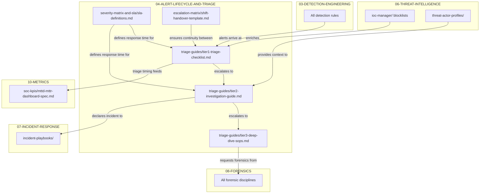

### What Each File Does

**severity-matrix-and-sla/sla-definitions.md** defines the severity levels (P1 through P4), what qualifies an alert for each level, and the SLA resolution targets. A P1 critical incident might require initial response within 15 minutes. A P4 informational alert might have a 72-hour window. These SLAs are not arbitrary targets. They become the metrics measured in Domain 10 and the compliance evidence presented in Domain 11.

**triage-guides/tier1-triage-checklist.md** is the step-by-step checklist a Tier 1 analyst follows when a new alert arrives. Check the source IP against the IOC blocklists. Verify whether the user account is a service account or a human. Look at the process tree. Check if the same alert has fired before and was closed as a false positive. Make a triage decision: close, escalate, or investigate further.

**triage-guides/tier2-investigation-guide.md** picks up where Tier 1 leaves off. The Tier 2 analyst conducts a deeper investigation, correlating the alert with other events in the same time window, checking lateral movement indicators, and determining whether the activity represents a real incident that requires declaration.

**triage-guides/tier3-deep-dive-sops.md** covers the most complex investigations. Tier 3 analysts are typically senior engineers or DFIR specialists who conduct memory forensics, disk analysis, and full packet capture review. This guide bridges Domain 04 with Domain 08 by defining exactly when and how to invoke forensic procedures.

**escalation-matrix/shift-handover-template.md** ensures that nothing falls through the cracks during shift changes. Every open alert, every in-progress investigation, and every pending escalation gets documented in a structured handover format so the incoming shift knows exactly where things stand.

---

## Domain 05: Threat Hunting

Detection rules are reactive. They catch what you already know to look for. Threat hunting is proactive. Domain 05 is where analysts form hypotheses about adversary behavior, execute queries to test those hypotheses, and convert findings into permanent detection rules.

### Directory Structure

```
05-THREAT-HUNTING/
    README.md
    hunt-hypotheses/
        HUNT-2026-01-dll-side-loading.md
    hunt-queries/
        hunting_rare_user_agents.kql
    hunt-reports/
        HUNT-REPORT-2026-01-summary.md
    jupyter-notebooks/
        process_anomaly_entropy_hunt.ipynb
```

### File-Level Connection Map

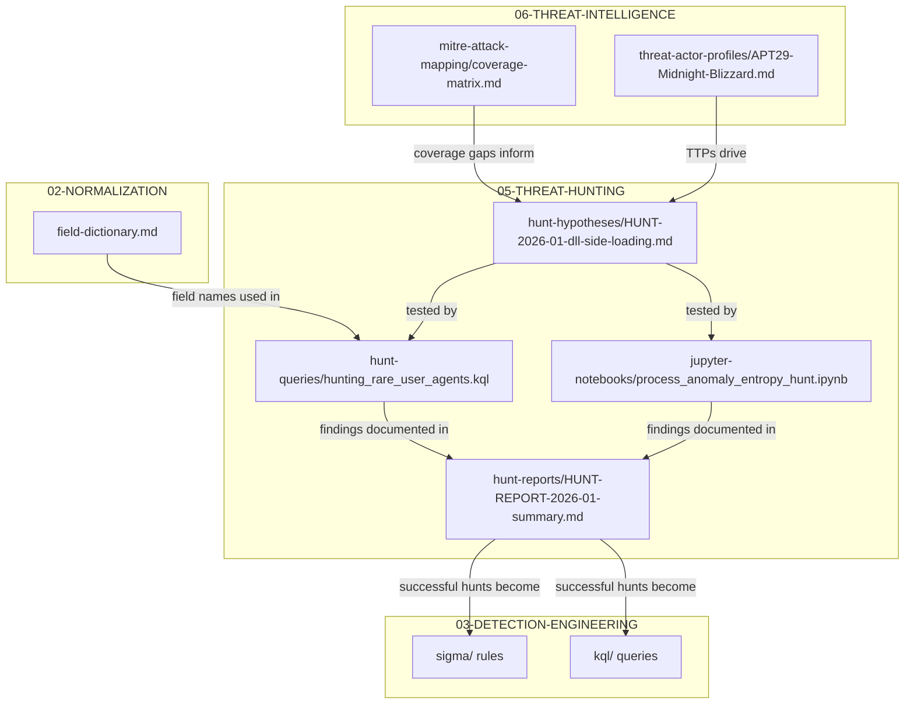

### What Each File Does

**hunt-hypotheses/HUNT-2026-01-dll-side-loading.md** documents a specific threat hunt hypothesis. In this case, the hypothesis is that adversaries may be exploiting DLL side-loading in legitimate signed applications to execute malicious code. The hypothesis includes the MITRE ATT&CK technique reference, the data sources needed to test it, and the expected indicators of compromise.

**hunt-queries/hunting_rare_user_agents.kql** is a KQL hunting query that identifies rare or anomalous HTTP user agent strings in proxy or web gateway logs. Unusual user agents can indicate custom malware, post-exploitation frameworks, or data exfiltration tools communicating with C2 infrastructure.

**hunt-reports/HUNT-REPORT-2026-01-summary.md** documents the results of a completed threat hunt. It includes what was hypothesized, what data was queried, what was found (or not found), and whether the findings warrant a new permanent detection rule. This report is the bridge between hunting and detection engineering.

**jupyter-notebooks/process_anomaly_entropy_hunt.ipynb** is an interactive notebook that uses statistical analysis and entropy calculations to identify anomalous process behavior. By measuring the Shannon entropy of process command-line arguments and comparing them to baseline distributions, it can surface obfuscated commands that traditional pattern matching would miss.

---

## Domain 06: Threat Intelligence and IOCs

Domain 06 is the knowledge layer. It brings external threat intelligence into the SOC, manages blocklists of known malicious indicators, maps adversary techniques to the MITRE ATT&CK framework, and profiles the threat actors most relevant to your organization.

### Directory Structure

```
06-THREAT-INTELLIGENCE-AND-IOCS/
    README.md
    ioc-manager/
        domain-blocklist.csv
        hash-blacklist.csv
        ip-reputation.csv
    mitre-attack-mapping/
        coverage-matrix.md
    threat-actor-profiles/
        APT29-Midnight-Blizzard.md
```

### File-Level Connection Map

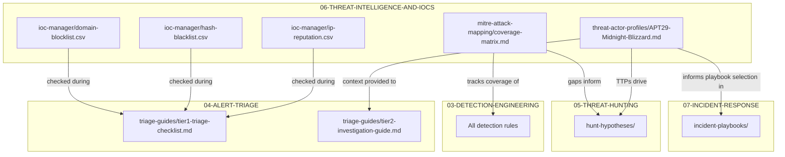

### What Each File Does

**ioc-manager/domain-blocklist.csv** is a structured list of known malicious domains. These are domains associated with phishing campaigns, malware distribution, C2 infrastructure, and data exfiltration. During triage, analysts check alert observables against this list for quick enrichment.

**ioc-manager/hash-blacklist.csv** contains SHA-256, SHA-1, and MD5 hashes of known malicious files. When a detection rule fires on a suspicious binary, the file hash is checked against this list to determine if it is a known threat.

**ioc-manager/ip-reputation.csv** catalogs IP addresses associated with malicious activity, including their reputation score, geographic origin, associated threat actor (if known), and the date they were added to the list.

**mitre-attack-mapping/coverage-matrix.md** is the detection coverage heatmap mapped to MITRE ATT&CK. It shows which techniques and sub-techniques are covered by existing detection rules, which have partial coverage, and which have no coverage at all. This matrix directly drives threat hunting priorities and detection engineering roadmap decisions.

**threat-actor-profiles/APT29-Midnight-Blizzard.md** profiles APT29, also known as Midnight Blizzard (formerly Nobelium), Cozy Bear, and The Dukes. This profile documents their known TTPs, targeted industries, historical campaigns, preferred initial access methods, and the specific detection rules in Domain 03 that are designed to catch their activity.

---

## Domain 07: Incident Response and SOAR

When triage confirms a real incident, Domain 07 takes over. This is where structured playbooks guide the response, automated scripts perform containment actions, and the bridge to forensic investigation begins.

### Directory Structure

```
07-INCIDENT-RESPONSE-AND-SOAR/
    README.md
    containment-decisions/
        isolation-approval-matrix.md
    incident-playbooks/
        cloud-compromise-playbook.md
        credential-dumping-playbook.md
        insider-threat-playbook.md
        phishing-playbook.md
        ransomware-playbook.md
    soar-automation/
        python-containment-scripts/
            disable_compromised_user.py
            isolate_host_edr.py
        webhook-integrations/
            slack_alert_notifier.py
```

### File-Level Connection Map

```mermaid
flowchart TD
    subgraph "07-INCIDENT-RESPONSE-AND-SOAR"
        RANSOM["incident-playbooks/ransomware-playbook.md"]
        PHISH["incident-playbooks/phishing-playbook.md"]
        CRED["incident-playbooks/credential-dumping-playbook.md"]
        CLOUD["incident-playbooks/cloud-compromise-playbook.md"]
        INSIDER["incident-playbooks/insider-threat-playbook.md"]
        ISOLATE["soar-automation/python-containment-scripts/isolate_host_edr.py"]
        DISABLE["soar-automation/python-containment-scripts/disable_compromised_user.py"]
        SLACK["soar-automation/webhook-integrations/slack_alert_notifier.py"]
        APPROVAL["containment-decisions/isolation-approval-matrix.md"]
    end

    subgraph "04-ALERT-TRIAGE"
        TRIAGE04["Tier 2 confirmed incident"]
    end

    subgraph "08-FORENSICS"
        WINFOR["windows-forensics/"]
        MEMFOR["memory-forensics/"]
        NETFOR["network-forensics/"]
    end

    subgraph "10-METRICS"
        PIR["post-incident-reviews-pir/"]
    end

    TRIAGE04 -->|"triggers"| RANSOM
    TRIAGE04 -->|"triggers"| PHISH
    TRIAGE04 -->|"triggers"| CRED
    TRIAGE04 -->|"triggers"| CLOUD
    TRIAGE04 -->|"triggers"| INSIDER
    RANSOM -->|"invokes"| ISOLATE
    CRED -->|"invokes"| DISABLE
    APPROVAL -->|"authorizes"| ISOLATE
    APPROVAL -->|"authorizes"| DISABLE
    RANSOM -->|"requests analysis from"| MEMFOR
    CRED -->|"requests analysis from"| WINFOR
    CLOUD -->|"requests analysis from"| NETFOR
    SLACK -->|"notifies team during"| RANSOM
    RANSOM -->|"PIR documented in"| PIR
    PHISH -->|"PIR documented in"| PIR
```

### What Each File Does

**incident-playbooks/ransomware-playbook.md** is the step-by-step response procedure for a ransomware incident. It covers initial containment (isolate affected hosts), evidence preservation (memory dump before reboot), scope assessment (which systems are encrypted), eradication (remove persistence mechanisms), recovery (restore from backups), and post-incident review.

**incident-playbooks/phishing-playbook.md** guides the response to confirmed phishing attacks. It includes steps for identifying all recipients, checking if anyone clicked the link or opened the attachment, resetting credentials for affected users, blocking the sender domain, and searching for similar messages across the organization.

**incident-playbooks/credential-dumping-playbook.md** handles incidents where credential theft tools like Mimikatz have been used. The response includes isolating the compromised host, forcing password resets for all accounts that were logged into the compromised system, revoking Kerberos tickets, and checking for lateral movement.

**incident-playbooks/cloud-compromise-playbook.md** covers incidents in cloud environments where IAM credentials have been compromised, S3 buckets have been exfiltrated, or cloud infrastructure has been modified by an attacker. It includes API key rotation, CloudTrail log review, and resource inventory comparison.

**incident-playbooks/insider-threat-playbook.md** addresses incidents involving malicious or negligent insiders. This playbook requires coordination with HR and Legal, has specific evidence preservation requirements for potential employment action, and includes data loss quantification steps.

**soar-automation/python-containment-scripts/isolate_host_edr.py** is a Python script that calls the EDR platform API to network-isolate a compromised host. Isolation cuts the host off from the network while maintaining the EDR management channel so forensic data can still be collected remotely.

**soar-automation/python-containment-scripts/disable_compromised_user.py** is a Python script that disables a compromised user account in Active Directory or the cloud identity provider. It revokes all active sessions, resets the password, and disables the account to prevent further adversary access.

**soar-automation/webhook-integrations/slack_alert_notifier.py** sends structured alert notifications to designated Slack channels during incident response. It formats the alert severity, affected assets, and current response status into a readable message so the incident response team stays informed in real time.

**containment-decisions/isolation-approval-matrix.md** defines who has the authority to approve host isolation and user account disablement. Not every analyst should be able to shut down a production server. This matrix specifies approval chains based on asset criticality and business impact.

---

## Domain 08: Forensics and Artefacts

When the investigation requires going deeper than log analysis, Domain 08 provides the forensic discipline guides. This domain covers five distinct forensic specialties, each with its own tools, techniques, and artefact types.

### Directory Structure

```
08-FORENSICS-AND-ARTEFACTS/
    README.md
    disk-forensics/
        disk-imaging-notes/
            e01-acquisition-sop.md
    linux-forensics/
        auditd-and-journalctl-investigation.md
    memory-forensics/
        volatility-plugins-and-profiles/
            volatility3-cheatsheet.md
    network-forensics/
        pcap-analysis/
            zeek-wireshark-triage.md
    windows-forensics/
        eventlog-analysis/
            evtx-carving-queries.md
        mft-prefetch-registry/
            prefetch-analysis-guide.md
```

### File-Level Connection Map

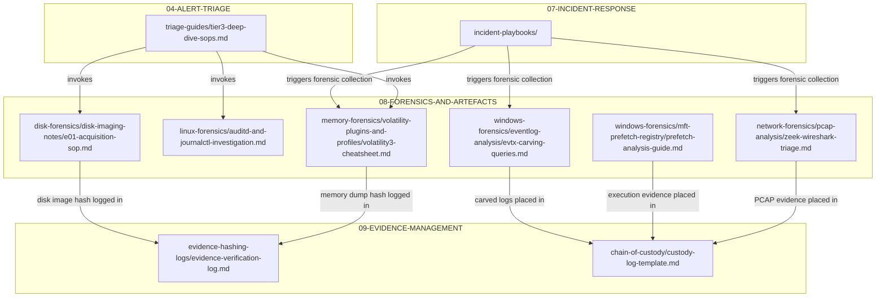

### What Each File Does

**disk-forensics/disk-imaging-notes/e01-acquisition-sop.md** is the standard operating procedure for acquiring disk images in E01 (Expert Witness) format. It covers write-blocker setup, acquisition tool selection (FTK Imager, dc3dd, ewfacquire), hash verification during acquisition, and the chain of custody documentation that must accompany every image.

**linux-forensics/auditd-and-journalctl-investigation.md** documents how to investigate security events on Linux systems using auditd logs and systemd journal entries. It covers key audit rules, how to parse ausearch output, and how to reconstruct a timeline of attacker activity from journal entries.

**memory-forensics/volatility-plugins-and-profiles/volatility3-cheatsheet.md** is a reference guide for Volatility 3 memory forensics. It covers the most commonly used plugins: pslist (process listing), netscan (network connections), malfind (injected code detection), dlllist (loaded DLLs), cmdline (process command lines), and handles (open handles). Each plugin entry includes the command syntax, expected output, and what to look for.

**network-forensics/pcap-analysis/zeek-wireshark-triage.md** guides the analysis of network packet captures using Zeek (formerly Bro) and Wireshark. It covers how to extract connection logs, HTTP transactions, DNS queries, TLS certificate information, and file carving from PCAPs to reconstruct network-based attack activity.

**windows-forensics/eventlog-analysis/evtx-carving-queries.md** provides techniques for recovering and analyzing Windows Event Log (EVTX) files, including carving deleted events, parsing specific Event IDs relevant to intrusions (4688, 4624, 4672, 7045, 1102), and correlating events across Security, System, and PowerShell logs.

**windows-forensics/mft-prefetch-registry/prefetch-analysis-guide.md** documents how to analyze Windows Prefetch files to determine which executables ran on a system, when they last ran, and how many times they ran. This is critical for establishing a timeline of malware execution even when the malware has been deleted.

---

## Domain 09: Evidence Management

Collecting forensic artefacts is only half the job. Those artefacts must be stored, hashed, tracked, and presented in a way that holds up under legal scrutiny and audit review. Domain 09 handles the governance of evidence itself.

### Directory Structure

```
09-EVIDENCE-MANAGEMENT/
    README.md
    chain-of-custody/
        custody-log-template.md
    evidence-hashing-logs/
        evidence-verification-log.md
    secure-vault-structure/
        vault-security-standards.md
```

### File-Level Connection Map

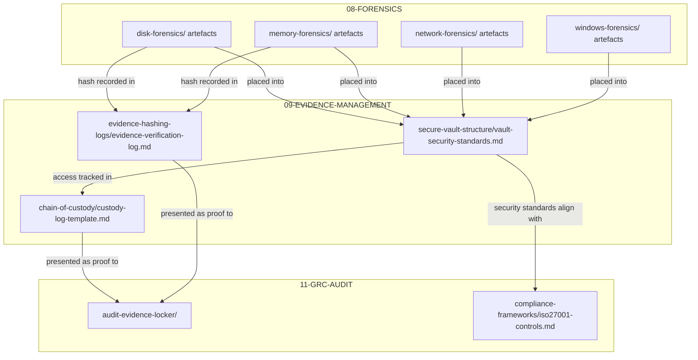

### What Each File Does

**chain-of-custody/custody-log-template.md** is the template for tracking who accessed, transferred, or modified a piece of evidence. Every entry includes a timestamp, the person's name and role, the action taken, and the reason. This log is legally significant because a broken chain of custody can invalidate evidence in court proceedings or regulatory investigations.

**evidence-hashing-logs/evidence-verification-log.md** records the SHA-256 hash of every evidence artefact at the time of acquisition and at each subsequent access. If the hash changes, the evidence has been tampered with. This log provides cryptographic proof of evidence integrity.

**secure-vault-structure/vault-security-standards.md** defines the access controls, encryption requirements, and storage architecture for the evidence vault. It specifies who can access the vault, what authentication is required, how evidence is encrypted at rest, and what the physical or logical separation requirements are.

---

## Domain 10: Metrics, KPIs, and Reporting

You cannot improve what you do not measure. Domain 10 is the performance measurement layer that quantifies how well the SOC is operating and surfaces that data for both operational tuning and executive reporting.

### Directory Structure

```
10-METRICS-KPI-AND-REPORTING/
    README.md
    executive-reports/
        monthly-executive-summary-template.md
    post-incident-reviews-pir/
        lessons-learned-action-items.md
        rca-template.md
    soc-kpis/
        alert-volume-metrics.md
        mttd-mttr-dashboard-spec.md
```

### File-Level Connection Map

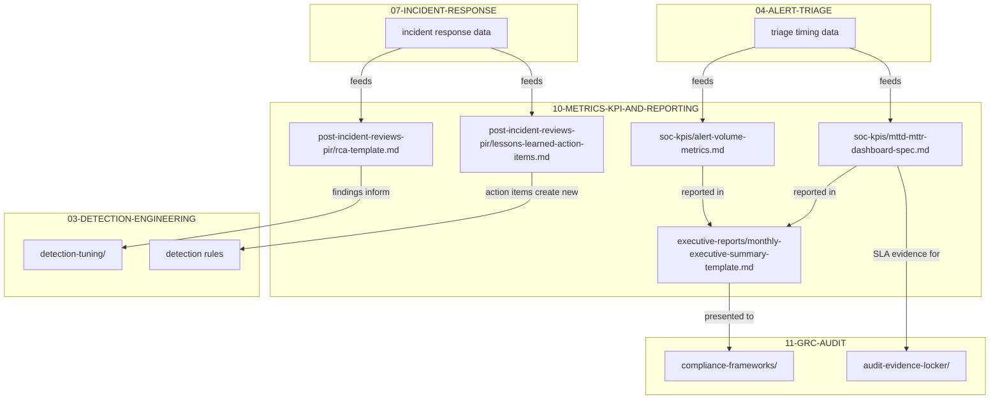

### What Each File Does

**soc-kpis/mttd-mttr-dashboard-spec.md** defines the dashboard specification for tracking Mean Time to Detect (how long from the moment an attack happens to the moment the SOC detects it) and Mean Time to Respond (how long from detection to containment). It includes the data sources, calculation formulas, visualization requirements, and alerting thresholds.

**soc-kpis/alert-volume-metrics.md** tracks the volume of alerts over time, broken down by severity, by detection rule, and by data source. This data reveals whether alert volume is growing unsustainably, which rules are generating the most noise, and where tuning efforts should be focused.

**executive-reports/monthly-executive-summary-template.md** is the template for the monthly CISO report. It rolls up the KPIs, notable incidents, detection engineering improvements, and risk posture changes into a format that executive leadership can understand without needing to know the technical details.

**post-incident-reviews-pir/rca-template.md** is the Root Cause Analysis template used after every significant incident. It documents the timeline of the incident, the root cause, the contributing factors, and the corrective actions. This is where the SOC learns from its mistakes and near-misses.

**post-incident-reviews-pir/lessons-learned-action-items.md** captures the specific action items that come out of post-incident reviews. Each action item includes an owner, a deadline, and the detection or process improvement it targets. These action items are the mechanism that turns incident pain into operational improvement.

---

## Domain 11: GRC, Audit, and Compliance

Domain 11 is the bridge between technical security operations and external regulatory requirements. Everything the SOC does across domains 01 through 10 ultimately produces evidence that Domain 11 maps to compliance frameworks and presents to auditors.

### Directory Structure

```
11-GRC-AUDIT-AND-COMPLIANCE/
    README.md
    audit-evidence-locker/
        access-review-evidence/
            quarterly-pam-access-review.md
        change-management-logs/
            detection-rule-change-log.md
        log-retention-proof/
            immutability-config-proof.md
    compliance-frameworks/
        iso27001-controls.md
        nist-csf-2.0.md
        soc2-type2-mapping.md
    risk-register-and-exceptions/
        policy-exceptions.md
        risk-register.md
```

### File-Level Connection Map

```mermaid
flowchart TD
    subgraph "11-GRC-AUDIT-AND-COMPLIANCE"
        SOC2["compliance-frameworks/soc2-type2-mapping.md"]
        ISO["compliance-frameworks/iso27001-controls.md"]
        NIST["compliance-frameworks/nist-csf-2.0.md"]
        PAM["audit-evidence-locker/access-review-evidence/quarterly-pam-access-review.md"]
        CHANGELOG["audit-evidence-locker/change-management-logs/detection-rule-change-log.md"]
        IMMUTABLE["audit-evidence-locker/log-retention-proof/immutability-config-proof.md"]
        RISK["risk-register-and-exceptions/risk-register.md"]
        EXCEPTIONS["risk-register-and-exceptions/policy-exceptions.md"]
    end

    subgraph "01-DATA-SOURCES"
        RETENTION01["log-retention-and-dlp/log-retention-policy.md"]
    end

    subgraph "03-DETECTION-ENGINEERING"
        SUPPRESS03["detection-tuning/rule-suppression-list.md"]
    end

    subgraph "09-EVIDENCE-MANAGEMENT"
        CUSTODY09["chain-of-custody/custody-log-template.md"]
        HASH09["evidence-hashing-logs/evidence-verification-log.md"]
    end

    subgraph "10-METRICS"
        EXEC10["executive-reports/monthly-executive-summary-template.md"]
    end

    subgraph "CI/CD"
        SIGMAVAL[".github/workflows/validate-sigma-rules.yml"]
    end

    RETENTION01 -->|"proves compliance with"| SOC2
    RETENTION01 -->|"proves compliance with"| ISO
    CUSTODY09 -->|"evidence for"| SOC2
    HASH09 -->|"integrity proof for"| ISO
    EXEC10 -->|"management review for"| ISO
    SIGMAVAL -->|"change approvals logged in"| CHANGELOG
    SUPPRESS03 -->|"exceptions documented in"| EXCEPTIONS
    IMMUTABLE -->|"proves log integrity for"| SOC2
    IMMUTABLE -->|"proves log integrity for"| NIST
    PAM -->|"access control evidence for"| SOC2
    PAM -->|"access control evidence for"| ISO
    RISK -->|"risk assessment for"| NIST
    RISK -->|"risk assessment for"| ISO
```

### What Each File Does

**compliance-frameworks/soc2-type2-mapping.md** maps SOC 2 Type II Trust Service Criteria to specific operational evidence across all domains. For each criterion (Security, Availability, Processing Integrity, Confidentiality, Privacy), it identifies which files, logs, and processes in this repository serve as evidence of compliance.

**compliance-frameworks/iso27001-controls.md** maps ISO 27001:2022 Annex A controls to operational evidence. Each control (such as A.8.15 Logging, A.8.16 Monitoring activities, A.5.24 Information security incident management) is linked to the specific domain and file that demonstrates compliance.

**compliance-frameworks/nist-csf-2.0.md** maps the NIST Cybersecurity Framework 2.0 functions (Govern, Identify, Protect, Detect, Respond, Recover) to operational evidence across the ecosystem.

**audit-evidence-locker/access-review-evidence/quarterly-pam-access-review.md** documents the quarterly review of Privileged Access Management. It records who has privileged access, whether that access is still justified, and what changes were made as a result of the review. This is a mandatory audit artifact for SOC 2 and ISO 27001.

**audit-evidence-locker/change-management-logs/detection-rule-change-log.md** logs every change to detection rules, including who made the change, when, why, what was changed, and whether it was approved through the CI/CD pipeline. The Sigma validation workflow in `.github/workflows/validate-sigma-rules.yml` directly feeds entries into this log.

**audit-evidence-locker/log-retention-proof/immutability-config-proof.md** provides evidence that log storage is configured for immutability, meaning logs cannot be modified or deleted after ingestion. This is a critical control for demonstrating that audit trails have not been tampered with.

**risk-register-and-exceptions/risk-register.md** is the formal risk register that documents identified risks, their likelihood, impact, current mitigating controls, residual risk level, and risk owner. This is a living document that gets reviewed during management review meetings.

**risk-register-and-exceptions/policy-exceptions.md** documents any approved exceptions to security policies. Each exception includes a justification, an approver, a compensating control, and an expiration date. This prevents "permanent exceptions" from accumulating without oversight.

---

## CI/CD Pipelines

The `.github/workflows/` directory contains the automated validation pipelines that enforce quality and governance on detection rules before they reach production.

### Pipeline Connection Map

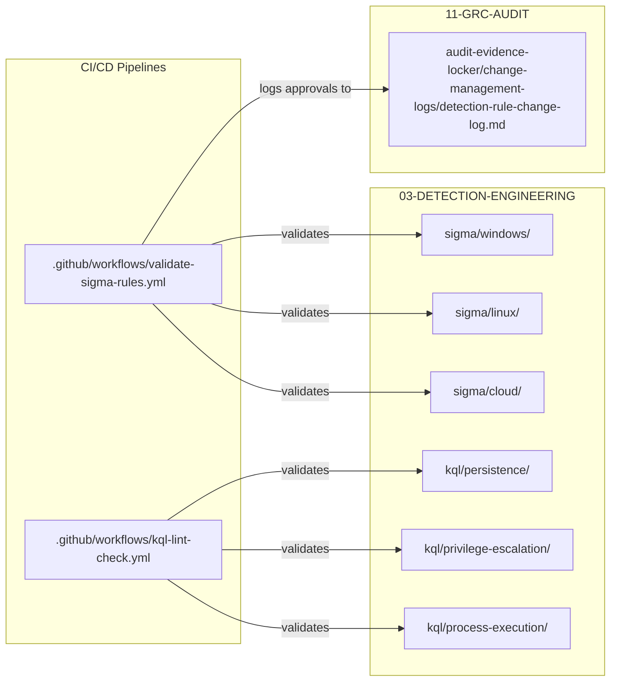

**validate-sigma-rules.yml** runs on every pull request that touches Sigma rule files. It performs YAML syntax validation, PySigma schema checking, and ensures that every rule has the required metadata fields (title, status, level, logsource, detection). Deployment approvals are logged to the change management log in Domain 11.

**kql-lint-check.yml** runs on every pull request that touches KQL files. It validates KQL syntax and checks for correct operator usage against Microsoft Sentinel and Defender query language specifications.

---

## Complete File Inventory

Every file in this repository, listed with its full path and its operational purpose.

| File Path | Purpose |
|-----------|---------|
| `README.md` | This file. Central architecture reference for the entire ecosystem. |
| `01-DATA-SOURCES-AND-INGESTION/README.md` | Architecture guide for log ingestion topology. |
| `01-DATA-SOURCES-AND-INGESTION/collectors-and-agents/fluentbit/fluent-bit.conf` | Fluent Bit log collector configuration. |
| `01-DATA-SOURCES-AND-INGESTION/collectors-and-agents/logstash/pipeline-syslog.conf` | Logstash syslog ingestion pipeline. |
| `01-DATA-SOURCES-AND-INGESTION/collectors-and-agents/vector/vector.yaml` | Vector observability pipeline configuration. |
| `01-DATA-SOURCES-AND-INGESTION/log-inventory/cloud-logs-aws-gcp-azure.md` | Cloud log source inventory. |
| `01-DATA-SOURCES-AND-INGESTION/log-inventory/edr-telemetry-inventory.md` | EDR telemetry source inventory. |
| `01-DATA-SOURCES-AND-INGESTION/log-inventory/sysmon-configs/sysmonconfig-export.xml` | Sysmon endpoint telemetry configuration. |
| `01-DATA-SOURCES-AND-INGESTION/log-inventory/windows-event-logs.md` | Windows Event Log channel and Event ID catalog. |
| `01-DATA-SOURCES-AND-INGESTION/log-retention-and-dlp/log-retention-policy.md` | Log retention periods and storage tier policy. |
| `02-NORMALIZATION-AND-PARSING/README.md` | Schema normalization overview. |
| `02-NORMALIZATION-AND-PARSING/field-dictionary.md` | Canonical field naming standard across all vendors. |
| `02-NORMALIZATION-AND-PARSING/custom-parsers/syslog-parsers/palo-alto-firewall.grok` | Grok pattern for Palo Alto firewall syslog. |
| `02-NORMALIZATION-AND-PARSING/ecs-mapping/ecs-process-event.json` | Elastic Common Schema process event mapping. |
| `02-NORMALIZATION-AND-PARSING/ocsf-mapping/ocsf-process-activity.json` | OCSF process activity event mapping. |
| `03-DETECTION-ENGINEERING/README.md` | Detection-as-Code framework overview. |
| `03-DETECTION-ENGINEERING/sigma/windows/proc_creation_win_mimikatz_cmdline.yml` | Sigma rule: Mimikatz command-line detection on Windows. |
| `03-DETECTION-ENGINEERING/sigma/linux/proc_creation_lnx_reversed_shell.yml` | Sigma rule: Reverse shell detection on Linux. |
| `03-DETECTION-ENGINEERING/sigma/cloud/aws_unusual_root_login.yml` | Sigma rule: Unusual AWS root account usage. |
| `03-DETECTION-ENGINEERING/kql/persistence/registry_runkeys_modification.kql` | KQL query: Registry Run key persistence detection. |
| `03-DETECTION-ENGINEERING/kql/privilege-escalation/lsass_memory_dumping.kql` | KQL query: LSASS memory dumping detection. |
| `03-DETECTION-ENGINEERING/kql/process-execution/suspicious_cmd_parent_child.kql` | KQL query: Suspicious cmd.exe parent-child relationships. |
| `03-DETECTION-ENGINEERING/sql/database-audit-queries/unauthorized_db_admin_creation.sql` | SQL query: Unauthorized database admin creation. |
| `03-DETECTION-ENGINEERING/suricata-snort/network-signatures/emerging_threats_c2.rules` | Suricata/Snort C2 network signatures. |
| `03-DETECTION-ENGINEERING/yara/malware-families/ransomware_generic_strings.yar` | YARA rule: Generic ransomware string patterns. |
| `03-DETECTION-ENGINEERING/yara/webshells/php_webshell_obfuscated.yar` | YARA rule: Obfuscated PHP webshell detection. |
| `03-DETECTION-ENGINEERING/detection-testing/atomic-red-team-tests/T1003.001-lsass-dump-test.yaml` | Atomic Red Team test: LSASS credential dump simulation. |
| `03-DETECTION-ENGINEERING/detection-testing/rule-validation-matrix.md` | Detection rule test coverage tracker. |
| `03-DETECTION-ENGINEERING/detection-tuning/false-positive-logs.md` | False positive investigation records. |
| `03-DETECTION-ENGINEERING/detection-tuning/rule-suppression-list.md` | Active rule suppression registry with approvals. |
| `04-ALERT-LIFECYCLE-AND-TRIAGE/README.md` | Alert operations overview. |
| `04-ALERT-LIFECYCLE-AND-TRIAGE/severity-matrix-and-sla/sla-definitions.md` | Severity levels and SLA resolution targets. |
| `04-ALERT-LIFECYCLE-AND-TRIAGE/triage-guides/tier1-triage-checklist.md` | Tier 1 analyst triage checklist. |
| `04-ALERT-LIFECYCLE-AND-TRIAGE/triage-guides/tier2-investigation-guide.md` | Tier 2 analyst investigation guide. |
| `04-ALERT-LIFECYCLE-AND-TRIAGE/triage-guides/tier3-deep-dive-sops.md` | Tier 3 deep forensic investigation SOPs. |
| `04-ALERT-LIFECYCLE-AND-TRIAGE/escalation-matrix/shift-handover-template.md` | Shift change handover documentation template. |
| `05-THREAT-HUNTING/README.md` | Threat hunting methodology overview. |
| `05-THREAT-HUNTING/hunt-hypotheses/HUNT-2026-01-dll-side-loading.md` | Hunt hypothesis: DLL side-loading in signed apps. |
| `05-THREAT-HUNTING/hunt-queries/hunting_rare_user_agents.kql` | KQL hunt query: Rare HTTP user agents. |
| `05-THREAT-HUNTING/hunt-reports/HUNT-REPORT-2026-01-summary.md` | Hunt report: Results and detection conversion. |
| `05-THREAT-HUNTING/jupyter-notebooks/process_anomaly_entropy_hunt.ipynb` | Jupyter notebook: Process entropy anomaly analysis. |
| `06-THREAT-INTELLIGENCE-AND-IOCS/README.md` | CTI architecture overview. |
| `06-THREAT-INTELLIGENCE-AND-IOCS/ioc-manager/domain-blocklist.csv` | Malicious domain blocklist. |
| `06-THREAT-INTELLIGENCE-AND-IOCS/ioc-manager/hash-blacklist.csv` | Malicious file hash blocklist. |
| `06-THREAT-INTELLIGENCE-AND-IOCS/ioc-manager/ip-reputation.csv` | IP reputation and threat scoring. |
| `06-THREAT-INTELLIGENCE-AND-IOCS/mitre-attack-mapping/coverage-matrix.md` | MITRE ATT&CK detection coverage heatmap. |
| `06-THREAT-INTELLIGENCE-AND-IOCS/threat-actor-profiles/APT29-Midnight-Blizzard.md` | Threat actor profile: APT29 / Midnight Blizzard. |
| `07-INCIDENT-RESPONSE-AND-SOAR/README.md` | IR and SOAR framework overview. |
| `07-INCIDENT-RESPONSE-AND-SOAR/incident-playbooks/ransomware-playbook.md` | Incident playbook: Ransomware response. |
| `07-INCIDENT-RESPONSE-AND-SOAR/incident-playbooks/phishing-playbook.md` | Incident playbook: Phishing response. |
| `07-INCIDENT-RESPONSE-AND-SOAR/incident-playbooks/credential-dumping-playbook.md` | Incident playbook: Credential theft response. |
| `07-INCIDENT-RESPONSE-AND-SOAR/incident-playbooks/cloud-compromise-playbook.md` | Incident playbook: Cloud environment compromise. |
| `07-INCIDENT-RESPONSE-AND-SOAR/incident-playbooks/insider-threat-playbook.md` | Incident playbook: Insider threat response. |
| `07-INCIDENT-RESPONSE-AND-SOAR/soar-automation/python-containment-scripts/isolate_host_edr.py` | SOAR script: EDR host network isolation. |
| `07-INCIDENT-RESPONSE-AND-SOAR/soar-automation/python-containment-scripts/disable_compromised_user.py` | SOAR script: Compromised user account disablement. |
| `07-INCIDENT-RESPONSE-AND-SOAR/soar-automation/webhook-integrations/slack_alert_notifier.py` | SOAR integration: Slack incident notifications. |
| `07-INCIDENT-RESPONSE-AND-SOAR/containment-decisions/isolation-approval-matrix.md` | Containment authorization and approval chains. |
| `08-FORENSICS-AND-ARTEFACTS/README.md` | DFIR architecture guide. |
| `08-FORENSICS-AND-ARTEFACTS/disk-forensics/disk-imaging-notes/e01-acquisition-sop.md` | Disk imaging SOP in E01 format. |
| `08-FORENSICS-AND-ARTEFACTS/linux-forensics/auditd-and-journalctl-investigation.md` | Linux forensic investigation via auditd and journalctl. |
| `08-FORENSICS-AND-ARTEFACTS/memory-forensics/volatility-plugins-and-profiles/volatility3-cheatsheet.md` | Volatility 3 memory forensics reference. |
| `08-FORENSICS-AND-ARTEFACTS/network-forensics/pcap-analysis/zeek-wireshark-triage.md` | Network PCAP triage with Zeek and Wireshark. |
| `08-FORENSICS-AND-ARTEFACTS/windows-forensics/eventlog-analysis/evtx-carving-queries.md` | Windows Event Log carving and analysis. |
| `08-FORENSICS-AND-ARTEFACTS/windows-forensics/mft-prefetch-registry/prefetch-analysis-guide.md` | Windows Prefetch execution analysis. |
| `09-EVIDENCE-MANAGEMENT/README.md` | Evidence locker standards. |
| `09-EVIDENCE-MANAGEMENT/chain-of-custody/custody-log-template.md` | Legal chain of custody tracking template. |
| `09-EVIDENCE-MANAGEMENT/evidence-hashing-logs/evidence-verification-log.md` | SHA-256 evidence integrity verification log. |
| `09-EVIDENCE-MANAGEMENT/secure-vault-structure/vault-security-standards.md` | Evidence vault access and encryption standards. |
| `10-METRICS-KPI-AND-REPORTING/README.md` | Metrics and reporting framework overview. |
| `10-METRICS-KPI-AND-REPORTING/soc-kpis/mttd-mttr-dashboard-spec.md` | MTTD and MTTR dashboard specification. |
| `10-METRICS-KPI-AND-REPORTING/soc-kpis/alert-volume-metrics.md` | Alert volume trend tracking. |
| `10-METRICS-KPI-AND-REPORTING/executive-reports/monthly-executive-summary-template.md` | Monthly CISO executive summary template. |
| `10-METRICS-KPI-AND-REPORTING/post-incident-reviews-pir/rca-template.md` | Root Cause Analysis template. |
| `10-METRICS-KPI-AND-REPORTING/post-incident-reviews-pir/lessons-learned-action-items.md` | Post-incident lessons learned action tracker. |
| `11-GRC-AUDIT-AND-COMPLIANCE/README.md` | Governance and audit overview. |
| `11-GRC-AUDIT-AND-COMPLIANCE/compliance-frameworks/soc2-type2-mapping.md` | SOC 2 Type II control evidence mapping. |
| `11-GRC-AUDIT-AND-COMPLIANCE/compliance-frameworks/iso27001-controls.md` | ISO 27001:2022 Annex A control mapping. |
| `11-GRC-AUDIT-AND-COMPLIANCE/compliance-frameworks/nist-csf-2.0.md` | NIST CSF 2.0 function evidence mapping. |
| `11-GRC-AUDIT-AND-COMPLIANCE/audit-evidence-locker/access-review-evidence/quarterly-pam-access-review.md` | Quarterly privileged access review evidence. |
| `11-GRC-AUDIT-AND-COMPLIANCE/audit-evidence-locker/change-management-logs/detection-rule-change-log.md` | Detection rule change management log. |
| `11-GRC-AUDIT-AND-COMPLIANCE/audit-evidence-locker/log-retention-proof/immutability-config-proof.md` | Log immutability configuration proof. |
| `11-GRC-AUDIT-AND-COMPLIANCE/risk-register-and-exceptions/risk-register.md` | Organizational risk register. |
| `11-GRC-AUDIT-AND-COMPLIANCE/risk-register-and-exceptions/policy-exceptions.md` | Approved policy exception registry. |
| `.github/workflows/validate-sigma-rules.yml` | CI/CD: Sigma rule validation pipeline. |
| `.github/workflows/kql-lint-check.yml` | CI/CD: KQL syntax lint pipeline. |

---

## Cross-Domain File Dependency Map

This is the unified view of which files depend on or feed into which other files across the entire ecosystem. Each row shows a source file, the target file it connects to, and the nature of that connection.

| Source File | Target File | Connection Type |
|-------------|-------------|-----------------|
| `fluent-bit.conf` | `custom-parsers/` | Forwards collected logs for parsing |
| `pipeline-syslog.conf` | `palo-alto-firewall.grok` | Syslog parsed by Grok patterns |
| `vector.yaml` | `ecs-mapping/`, `ocsf-mapping/` | Forwards logs for schema mapping |
| `sysmonconfig-export.xml` | `custom-parsers/` | Generates telemetry that parsers normalize |
| `field-dictionary.md` | All Sigma, KQL, and hunt query files | Canonical field names referenced by all queries |
| `ecs-process-event.json` | `sigma/` rules, `kql/` queries | Normalized fields consumed by detection logic |
| `ocsf-process-activity.json` | `sigma/` rules, `kql/` queries | Normalized fields consumed by detection logic |
| All Sigma rules | `triage-guides/tier1-triage-checklist.md` | Fired alerts processed by Tier 1 |
| All KQL queries | `triage-guides/tier1-triage-checklist.md` | Fired alerts processed by Tier 1 |
| `emerging_threats_c2.rules` | `triage-guides/tier1-triage-checklist.md` | Network alerts processed by Tier 1 |
| `T1003.001-lsass-dump-test.yaml` | `lsass_memory_dumping.kql`, Mimikatz Sigma rule | Validates detection rules fire correctly |
| `false-positive-logs.md` | All detection rules | Tuning feedback loop |
| `rule-suppression-list.md` | All detection rules, `policy-exceptions.md` | Suppression governance |
| `tier1-triage-checklist.md` | `domain-blocklist.csv`, `hash-blacklist.csv`, `ip-reputation.csv` | IOC enrichment during triage |
| `tier2-investigation-guide.md` | `APT29-Midnight-Blizzard.md` | Threat actor context during investigation |
| `tier3-deep-dive-sops.md` | All files in `08-FORENSICS-AND-ARTEFACTS/` | Invokes forensic analysis |
| `sla-definitions.md` | `mttd-mttr-dashboard-spec.md` | SLA targets measured by KPIs |
| `coverage-matrix.md` | `hunt-hypotheses/` | Detection gaps drive hunt priorities |
| `APT29-Midnight-Blizzard.md` | `hunt-hypotheses/`, incident playbooks | TTPs inform hunting and response |
| All incident playbooks | `08-FORENSICS-AND-ARTEFACTS/` files | Trigger forensic collection |
| `isolate_host_edr.py` | `isolation-approval-matrix.md` | Requires authorization before execution |
| `disable_compromised_user.py` | `isolation-approval-matrix.md` | Requires authorization before execution |
| `e01-acquisition-sop.md` | `evidence-verification-log.md` | Disk image hash recorded |
| `volatility3-cheatsheet.md` | `evidence-verification-log.md` | Memory dump hash recorded |
| All forensic artefacts | `custody-log-template.md` | Chain of custody tracked |
| All forensic artefacts | `vault-security-standards.md` | Stored in secure vault |
| `custody-log-template.md` | `audit-evidence-locker/` | Presented to auditors |
| `evidence-verification-log.md` | `audit-evidence-locker/` | Presented to auditors |
| `mttd-mttr-dashboard-spec.md` | `monthly-executive-summary-template.md` | KPIs included in executive report |
| `rca-template.md` | `detection-tuning/` files | RCA findings drive tuning |
| `lessons-learned-action-items.md` | Detection rules in Domain 03 | Action items create new rules |
| `log-retention-policy.md` | `immutability-config-proof.md` | Retention policy proven by config |
| `log-retention-policy.md` | `soc2-type2-mapping.md`, `iso27001-controls.md` | Retention compliance evidence |
| `validate-sigma-rules.yml` | All Sigma rule files | Lints and validates before merge |
| `validate-sigma-rules.yml` | `detection-rule-change-log.md` | Logs deployment approvals |
| `kql-lint-check.yml` | All KQL query files | Validates syntax before merge |

---

## Who Uses What

Different roles interact with different parts of this ecosystem. This table maps each role to the domains and files they work with most frequently.

| Role | Primary Domains | Key Files |
|------|----------------|-----------|
| **SOC Analyst (Tier 1)** | 04, 06 | `tier1-triage-checklist.md`, `sla-definitions.md`, IOC blocklists, `shift-handover-template.md` |
| **SOC Analyst (Tier 2)** | 04, 06, 07 | `tier2-investigation-guide.md`, `APT29-Midnight-Blizzard.md`, incident playbooks |
| **SOC Analyst (Tier 3)** | 04, 08, 09 | `tier3-deep-dive-sops.md`, all forensic guides, `custody-log-template.md` |
| **Detection Engineer** | 02, 03, 05 | `field-dictionary.md`, all Sigma/KQL/YARA rules, `false-positive-logs.md`, `rule-validation-matrix.md` |
| **Threat Hunter** | 05, 06, 02 | `hunt-hypotheses/`, `hunt-queries/`, `coverage-matrix.md`, `field-dictionary.md`, Jupyter notebooks |
| **DFIR Specialist** | 07, 08, 09 | Incident playbooks, all forensic discipline guides, `evidence-verification-log.md`, SOAR scripts |
| **SOC Manager** | 10, 04 | `mttd-mttr-dashboard-spec.md`, `alert-volume-metrics.md`, `monthly-executive-summary-template.md` |
| **GRC Auditor** | 11, 09, 10 | Compliance framework mappings, `audit-evidence-locker/`, `risk-register.md`, `policy-exceptions.md` |
| **CISO / Executive** | 10, 11 | `monthly-executive-summary-template.md`, `risk-register.md`, compliance framework mappings |
| **DevSecOps / Platform** | 01, 02, CI/CD | Collector configs, parser configs, `validate-sigma-rules.yml`, `kql-lint-check.yml` |

---

## Getting Started

If you are new to this repository, here is the recommended path through the material based on your role.

**If you are a SOC analyst**, start with `04-ALERT-LIFECYCLE-AND-TRIAGE/triage-guides/tier1-triage-checklist.md` to understand the triage workflow. Then read `04-ALERT-LIFECYCLE-AND-TRIAGE/severity-matrix-and-sla/sla-definitions.md` to learn the severity levels and response time expectations. Familiarize yourself with the IOC blocklists in `06-THREAT-INTELLIGENCE-AND-IOCS/ioc-manager/` so you know where to check observables during triage.

**If you are a detection engineer**, start with `02-NORMALIZATION-AND-PARSING/field-dictionary.md` to learn the canonical field names. Then review the existing rules in `03-DETECTION-ENGINEERING/sigma/` and `03-DETECTION-ENGINEERING/kql/` to understand the current detection coverage. Check `06-THREAT-INTELLIGENCE-AND-IOCS/mitre-attack-mapping/coverage-matrix.md` to see where gaps exist. Review `03-DETECTION-ENGINEERING/detection-tuning/false-positive-logs.md` to understand what has caused problems in the past.

**If you are a threat hunter**, start with `06-THREAT-INTELLIGENCE-AND-IOCS/mitre-attack-mapping/coverage-matrix.md` to identify detection gaps worth hunting. Review `06-THREAT-INTELLIGENCE-AND-IOCS/threat-actor-profiles/APT29-Midnight-Blizzard.md` for adversary TTP inspiration. Then look at `05-THREAT-HUNTING/hunt-hypotheses/` for examples of how to structure a hunt, and `05-THREAT-HUNTING/hunt-queries/` for query templates.

**If you are a DFIR specialist**, start with `07-INCIDENT-RESPONSE-AND-SOAR/incident-playbooks/` to understand the response procedures you will be supporting. Then review all five forensic discipline guides in `08-FORENSICS-AND-ARTEFACTS/`. Pay close attention to `09-EVIDENCE-MANAGEMENT/chain-of-custody/custody-log-template.md` because every artefact you collect must be tracked there.

**If you are a GRC auditor**, start with the three compliance framework mappings in `11-GRC-AUDIT-AND-COMPLIANCE/compliance-frameworks/`. These will tell you exactly where to find evidence for each control. The `11-GRC-AUDIT-AND-COMPLIANCE/audit-evidence-locker/` directory contains the actual evidence artifacts organized by audit requirement.

**If you are setting up the infrastructure**, start with the collector configurations in `01-DATA-SOURCES-AND-INGESTION/collectors-and-agents/` and the parser configurations in `02-NORMALIZATION-AND-PARSING/custom-parsers/`. Then set up the CI/CD pipelines by reviewing `.github/workflows/validate-sigma-rules.yml` and `.github/workflows/kql-lint-check.yml`.
